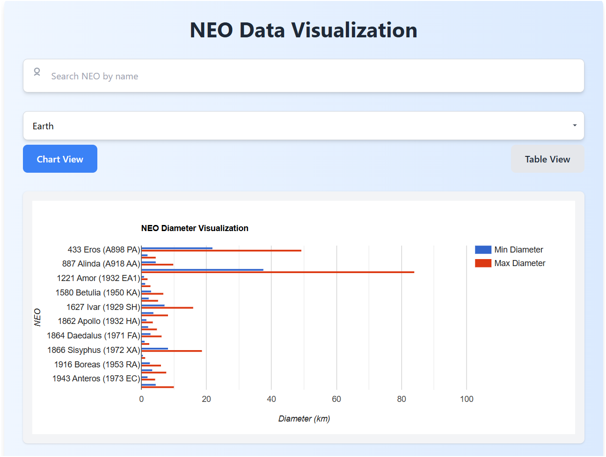
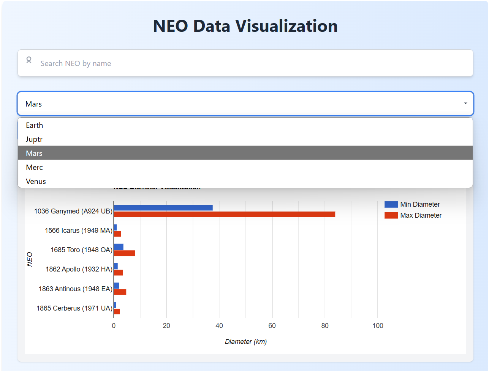
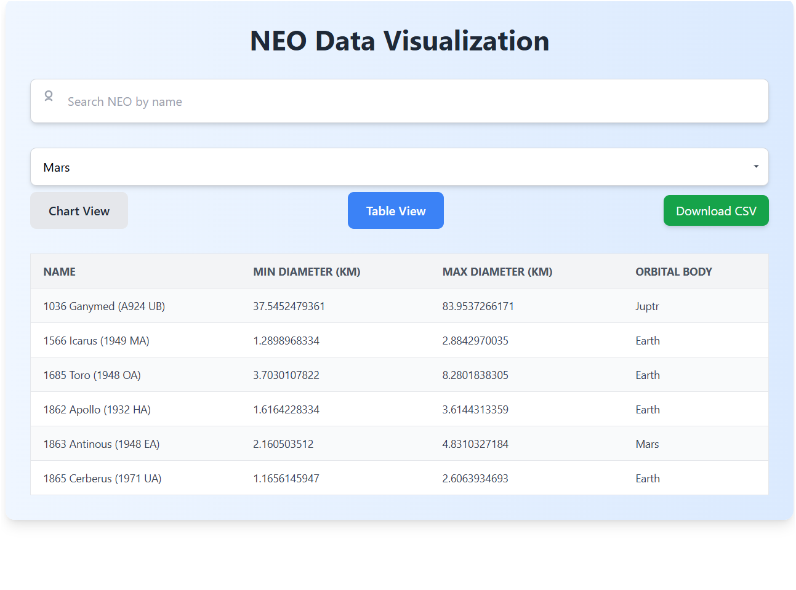

# 🌍 NEO Data Visualization App

This project is a web application that visualizes Near-Earth Objects (NEOs) from NASA's NeoWs (Near Earth Object Web Service) API. It allows users to filter NEO data, visualize the diameters of objects in a **bar chart**, switch to a **table view**, and **download the data as CSV**.

## 🌐 Live Demo
You can view a live demo of the application [here](https://neo-mansy.vercel.app/).

## 📄 Test PDF
You can find the assessment/test document used for this application [here](./React_Test_Requeue.pdf).


## 🚀 Features

- **NEO Data Fetching**: Fetches data from NASA's NeoWs API.
- **Bar Chart Visualization**: Displays NEO min and max diameters in a bar chart sorted by average diameter.
- **Table View**: Displays NEO data in a table format with sorting and filtering options.
- **Search Functionality**: Allows users to search NEOs by name.
- **Dropdown Filter**: Filters NEOs based on the selected orbital body.
- **View Switcher**: Easily switch between table view and chart view.
- **CSV Download**: Download the table data as a CSV file.
- **Loading Spinner**: Shows a spinner while data is being fetched.

## 🖼️ Screenshots

### 1. **Home Page - Bar Chart View**



### 2. **Search and Filter**



### 3. **Table View**




## 🛠️ Tech Stack

- **React** with **Vite** for fast development
- **TypeScript** for static typing
- **Tailwind CSS** for professional and responsive styling
- **Google Charts** for data visualization
- **MUI (Material UI)** for form components (dropdown, etc.)
- **NASA NeoWs API** for real-time NEO data

## 💻 Setup and Installation

1. Clone the repository:

   ```bash
   git clone https://github.com/MMansy19/NEO-Data-Visualization.git
   cd neo-data-visualization
   ```

2. Install dependencies:

   ```bash
   npm install
   ```


4. Start the development server:

   ```bash
   npm run dev
   ```

   The app will be available at `http://localhost:5173`.

## 🧪 Running Tests

There are no automated tests provided in this project, but you can manually verify functionality by interacting with the app in your browser:
1. Use the **Search Bar** to filter NEOs by name.
2. Switch between **Bar Chart** and **Table View** using the provided buttons.
3. Filter by **Orbital Body** using the dropdown.
4. Download the data as a **CSV file** using the download button.

## 📝 Author

👤 **[Mahmoud Mansy]**

- Portfolio: [Mahmoud Mansy Portfolio](https://mahmoud-mansy-portfolio.netlify.app/)
- GitHub: [@MMansy19](https://github.com/MMansy19)
- LinkedIn: [Mahmoud Mansy](https://www.linkedin.com/in/mahmoud-mansy-a189a5232)
- Email: [mahmoud2abdalfattah@gmail.com](mailto:mahmoud2abdalfattah@gmail.com)

## 📃 License

This project is licensed under the MIT License - see the [LICENSE](LICENSE) file for details.

## 📧 Contact

For questions, suggestions, or contributions, feel free to contact me via GitHub or LinkedIn!

